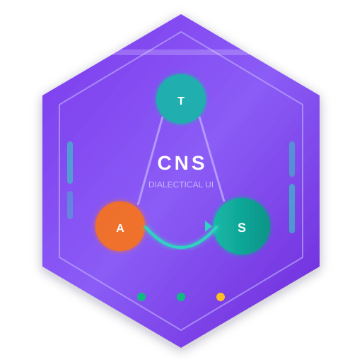

<div align="center"></div>

# CNS UI

[](https://hex.pm/packages/cns_ui)
[](https://hexdocs.pm/cns_ui)
[](LICENSE)

**Phoenix LiveView interface for CNS (Critic-Network Synthesis) dialectical reasoning experiments.**

CNS UI provides a comprehensive web-based dashboard for managing, visualizing, and analyzing dialectical reasoning processes. Built on Phoenix LiveView, it offers real-time visualization of thesis-antithesis-synthesis flows, evidence grounding analysis, and training experiment management.

## Features

### Dialectical Reasoning Visualization
- Interactive thesis-antithesis-synthesis flow diagrams
- Real-time rendering of dialectical graph structures
- Visual representation of proposition relationships
- Animated synthesis emergence displays

### SNO (Structured Narrative Object) Explorer
- Hierarchical SNO browser with search and filtering
- Detailed SNO inspection views
- Proposition-level drill-down capabilities
- Evidence chain visualization
- Citation cross-referencing

### Evidence Grounding Displays
- Source document linking
- Citation validation status indicators
- Confidence score overlays
- Provenance tracking visualization

### Chirality and Topology Metrics
- Chirality score dashboards with historical trends
- Fisher-Rao metric displays
- Betti number (topology) visualizations
- Geometric invariant tracking
- Interactive metric exploration

### Training Experiment Management
- Dataset upload and configuration
- Model parameter configuration UI
- Training progress monitoring
- Checkpoint management
- Result comparison tools

### Citation Validation Dashboards
- Automated citation verification status
- Source reliability scoring
- Dead link detection
- Citation completeness metrics
- Batch validation tools

### Quality Metrics
- Entailment verification scores
- Pass rate tracking across experiments
- Consistency metrics
- Temporal quality trends
- Export and reporting capabilities

## Screenshots

*Screenshots coming soon*

## Installation

Add `cns_ui` to your list of dependencies in `mix.exs`:

```elixir
def deps do
  [
    {:cns_ui, "~> 0.1.0"}
  ]
end
```

Then run:

```bash
mix deps.get
mix ecto.setup
```

## Configuration

Configure CNS UI in your `config/config.exs`:

```elixir
config :cns_ui,
  # CNS core library connection
  cns_core_endpoint: "http://localhost:4001",

  # Database configuration
  database_url: System.get_env("DATABASE_URL"),

  # Visualization settings
  max_graph_nodes: 1000,
  default_layout: :hierarchical,

  # Experiment settings
  checkpoint_dir: "priv/checkpoints",
  max_concurrent_experiments: 3
```

### Environment Variables

| Variable | Description | Default |
|----------|-------------|---------|
| `DATABASE_URL` | PostgreSQL connection URL | `postgres://localhost/cns_ui_dev` |
| `SECRET_KEY_BASE` | Phoenix secret key | Generated |
| `CNS_CORE_URL` | CNS core library endpoint | `http://localhost:4001` |
| `PHX_HOST` | Application host | `localhost` |
| `PORT` | Application port | `4000` |
| `CRUCIBLE_API_URL` | Base URL for the Crucible Framework API | `http://localhost:4100` |
| `CRUCIBLE_API_TOKEN` | Bearer token for Crucible API requests | _none_ |
| `CRUCIBLE_PUBSUB_NAME` | PubSub name to listen for Crucible job updates | `CrucibleUI.PubSub` |

## Development

### Prerequisites

- Elixir 1.14+
- Erlang/OTP 25+
- PostgreSQL 14+
- Node.js 18+ (for asset compilation)

### Setup

```bash
# Clone the repository
git clone https://github.com/North-Shore-AI/cns_ui.git
cd cns_ui

# Install dependencies
mix deps.get

# Setup database
mix ecto.setup

# Install Node.js dependencies
cd assets && npm install && cd ..

# Start Phoenix server
mix phx.server
```

Visit [`localhost:4000`](http://localhost:4000) in your browser.

### Crucible Integration

- Training runs are submitted through `CnsUi.CrucibleClient` to Crucible (`/api/jobs`).
- PubSub updates are consumed from the configured `CRUCIBLE_PUBSUB_NAME` (defaults to `CrucibleUI.PubSub` when co-deployed).
- To point CNS UI at a remote Crucible deployment, set `CRUCIBLE_API_URL` and `CRUCIBLE_API_TOKEN` accordingly; no Tinkex configuration is required.
- After submission, users are redirected to `/runs/:id` for live Crucible job status and telemetry.

### Composable Feature Routes

CNS UI integrates two composable feature libraries via custom backend implementations:

#### Labeling Routes (from Ingot)

**Mounted at:** `/labeling`
**Backend:** `CnsUi.LabelingBackend` ([lib/cns_ui/labeling_backend.ex](/home/home/p/g/North-Shore-AI/cns_ui/lib/cns_ui/labeling_backend.ex))

Provides SNO annotation workflows aligned with CNS 3.0 agent architecture:

**Available Queues:**

| Queue ID | Purpose | Status | Validates |
|----------|---------|--------|-----------|
| `sno_validation` | Validate Proposer agent output | Production | Claim grounding, citation accuracy, entailment scores |
| `antagonist_review` | Review Antagonist contradiction flags | Planned | β₁ gaps, chirality scores, contradiction precision |
| `synthesis_verification` | Verify Synthesizer output quality | Planned | β₁ reduction, topological coherence, evidence integration |

**Key Routes:**
- `GET /labeling/queue/:queue_id` - Queue dashboard with statistics
- `GET /labeling/assignment/:id` - Label assignment view with schema
- `POST /labeling/labels` - Submit label (updates SNO status)

**Backend Implementation Highlights:**

```elixir
# CnsUi.LabelingBackend implements Ingot.Labeling.Backend
@behaviour Ingot.Labeling.Backend

# Core callbacks:
def get_next_assignment(queue_id, user_id, opts)  # Returns next SNO/flag/synthesis
def submit_label(assignment_id, label_data, opts) # Stores label, updates status
def get_queue_stats(queue_id, opts)               # Aggregate statistics
def check_queue_access(user_id, queue_id, opts)   # Future: RBAC

# Integration with CNS contexts:
- CnsUi.SNOs - SNO data management (status updates, metadata)
- Future: CnsUi.AntagonistFlags, CnsUi.SynthesisCandidates

# Telemetry events emitted:
- [:cns_ui, :labeling, :assignment, :fetched]
- [:cns_ui, :labeling, :label, :submitted]
- [:cns_ui, :labeling, :queue, :stats]
```

**Example Usage:**

```bash
# Navigate to SNO validation queue
open http://localhost:4000/labeling/queue/sno_validation

# System assigns next pending SNO
# Reviewer validates:
# - Citation accuracy (references exist, support claim polarity)
# - Grounding score (entailment ≥ 0.75)
# - Semantic similarity (cosine ≥ 0.7)

# Submit label → SNO status updates:
# "accept" → "validated"
# "reject" → "rejected"
# "needs_review" → flags for domain expert
```

#### Experiment Routes (from Crucible UI)

**Mounted at:** `/crucible/experiments`
**Backend:** `CnsUi.ExperimentBackend` ([lib/cns_ui/experiment_backend.ex](/home/home/p/g/North-Shore-AI/cns_ui/lib/cns_ui/experiment_backend.ex))

Provides standardized experiment dashboards integrated with CNS training workflows:

**Key Routes:**
- `GET /crucible/experiments` - List all CNS experiments
- `GET /crucible/experiments/:id` - Experiment detail with training runs
- `GET /crucible/experiments/:id/runs` - Run list for experiment
- `GET /crucible/experiments/runs/:id` - Individual run monitoring

**Backend Implementation Highlights:**

```elixir
# CnsUi.ExperimentBackend implements Crucible.UI.Backend
@behaviour Crucible.UI.Backend

# Core callbacks:
def list_experiments(opts)                     # Filter by status, limit
def get_experiment_with_associations(id)       # Preloads training runs
def create_experiment(attrs)                   # New experiment creation
def list_runs(experiment_id, opts)             # Runs for experiment
def get_statistics(id)                         # Run/experiment stats
def get_system_statistics()                    # System-wide aggregates

# Integration with CNS contexts:
- CnsUi.Experiments - Experiment CRUD, status tracking
- CnsUi.Training - Training run management, metrics storage

# Telemetry events emitted:
- [:cns_ui, :experiment, :listed]
- [:cns_ui, :experiment, :created]
- [:cns_ui, :experiment, :updated]
- [:cns_ui, :run, :listed]
- [:cns_ui, :run, :fetched]
- [:cns_ui, :stats, :computed]
- [:cns_ui, :stats, :system]

# PubSub topics for real-time updates:
- "cns:experiment:{id}" - Experiment-level events
- "cns:run:{id}" - Run-level events (loss, metrics, checkpoints)
```

**Example Usage:**

```bash
# List all experiments
open http://localhost:4000/crucible/experiments

# View specific experiment with runs
open http://localhost:4000/crucible/experiments/123

# Monitor individual training run
open http://localhost:4000/crucible/experiments/runs/456

# Real-time updates via PubSub:
# - Loss curves streaming from Crucible Framework
# - Checkpoint creation notifications
# - Metric snapshot updates (entailment, similarity, β₁)
```

**Relationship to Native Routes:**

CNS UI provides **both** native (`/experiments`) and Crucible UI (`/crucible/experiments`) routes:

| Route | Purpose | Use When |
|-------|---------|----------|
| `/experiments` | CNS-specific experiment creation/editing | Creating new experiments, configuring CNS agents, setting quality thresholds |
| `/crucible/experiments` | Standardized experiment monitoring | Viewing run statistics, comparing experiments, exporting results |

Both share the same backend data (`CnsUi.Experiments`, `CnsUi.Training`) but provide different UIs optimized for different workflows.

### Running Tests

```bash
# Run all tests
mix test

# Run with coverage
mix test --cover

# Run specific test file
mix test test/cns_ui_web/live/sno_live_test.exs
```

### Code Quality

```bash
# Format code
mix format

# Run Credo for static analysis
mix credo --strict

# Run Dialyzer for type checking
mix dialyzer
```

## Architecture

CNS UI follows a layered Phoenix LiveView architecture:

```
lib/
  cns_ui/           # Core business logic
    experiments/    # Experiment management
    sno/            # SNO data structures
    metrics/        # Quality metrics
  cns_ui_web/       # Web layer
    live/           # LiveView components
      dashboard/    # Main dashboard views
      sno/          # SNO explorer views
      experiments/  # Experiment management views
      visualization/ # Graph and chart components
    components/     # Reusable UI components
```

Crucible alignment:
- Training workflows delegate job orchestration to Crucible (`CnsUi.CrucibleClient`).
- Metrics/tiles use the shared Crucible UI component styling to stay consistent with Crucible UI.
- PubSub subscriptions can be pointed at a co-deployed Crucible instance for live run updates.

For detailed architecture documentation, see [docs/20251121/architecture.md](docs/20251121/architecture.md).

## Documentation

- [Architecture Overview](docs/20251121/architecture.md)
- [Feature Specifications](docs/20251121/features.md)
- [Visualization Guide](docs/20251121/visualization_guide.md)
- [Experiment Workflow](docs/20251121/experiment_workflow.md)

## Contributing

1. Fork the repository
2. Create your feature branch (`git checkout -b feature/amazing-feature`)
3. Commit your changes (`git commit -m 'Add amazing feature'`)
4. Push to the branch (`git push origin feature/amazing-feature`)
5. Open a Pull Request

Please ensure your code:
- Passes all tests
- Follows the existing code style
- Includes appropriate documentation
- Has zero compilation warnings

## License

Copyright 2024-2025 North-Shore-AI

Licensed under the Apache License, Version 2.0 (the "License");
you may not use this file except in compliance with the License.
You may obtain a copy of the License at

    http://www.apache.org/licenses/LICENSE-2.0

Unless required by applicable law or agreed to in writing, software
distributed under the License is distributed on an "AS IS" BASIS,
WITHOUT WARRANTIES OR CONDITIONS OF ANY KIND, either express or implied.
See the License for the specific language governing permissions and
limitations under the License.

## Acknowledgments

- Built on [Phoenix Framework](https://phoenixframework.org/)
- Part of the [North-Shore-AI](https://github.com/North-Shore-AI) research ecosystem
- Integrates with [Crucible Framework](https://github.com/North-Shore-AI/crucible_framework) for experiment orchestration
